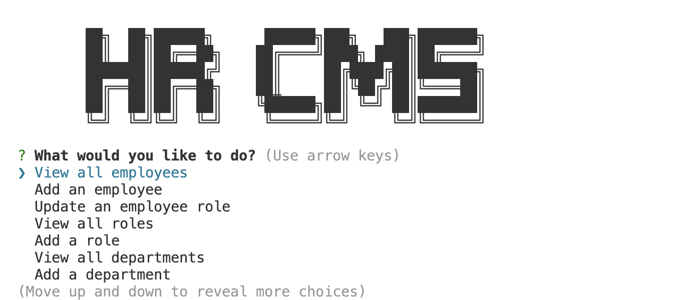

# HRMS

## Description

Human Resources Management System is a command line based employee management software where you can track, add, update employees, their roles, and departments.

Demo: https://youtu.be/ntqbDKYfPnc

## Table of Contents 

- [Installation](#installation)
- [Usage](#usage)
- [Credits](#credits)
- [License](#license)

## Installation
Requires node package manager

How do I install Dependencies?
npm i

## Usage

Use this for basic employee, employee role & salary and department traking

## Credits

## License 

This project is licensed under the MIT License.

Find more about this license here: https://opensource.org/licenses/MIT.

        

## Tests

How do I run tests?
no testing

## Questions

Please direct your questions towards Ben at:
Github: zaczacariah
Email: ben-zac@outlook.com

    